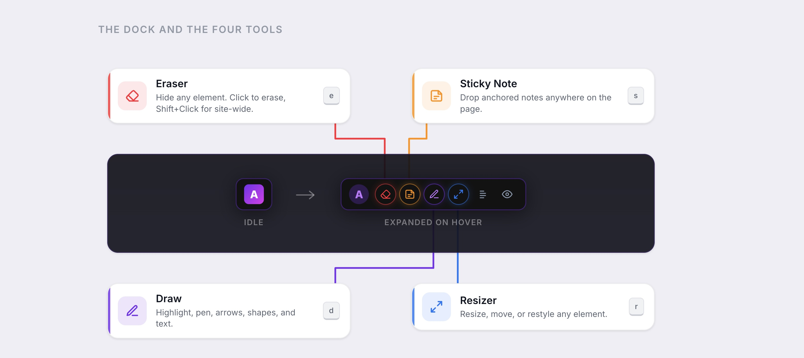

# Adnota — Annotate and edit the web

Highlight what's notable, eliminate what's not.

<p align="center">
  
</p>

Treat any website like your personal canvas. Erase what you don't need. Annotate what matters. Highlight, redact, and draw — all persistent across sessions, all stored privately on your machine.

Adnota is a Manifest V3 Chrome Extension built around a single core idea: **your annotations live with the page, not in a silo.** Every change you make to a website persists automatically, restores on the next visit, and is instantly accessible from a dedicated history view. No accounts, no cloud, no data leaving the browser.

Mark it up. Block it out. Make it yours.

Brand color purple: #7c3aed

The product North Star: Adnota today is "make any webpage yours" (destructive + additive edits on any specific page)

---

## Install

**Chrome Web Store** — coming soon.

**Load unpacked (current path):**

1. Clone or download this repo
2. Open `chrome://extensions` in Chrome
3. Enable **Developer mode** (top-right toggle)
4. Click **Load unpacked** and select the repo's root directory
5. Pin the Adnota icon in the toolbar for easy access

The repo root loads directly — no build step needed to try it. To run the minified bundle that ships to the Web Store, see [Build](#build) and load `dist/` instead.

---

## Keyboard Shortcuts

Two layers: **global** (work anywhere, always) and **bare-key** (work only when the dock is visible AND no input/textarea/contenteditable is focused AND no modifier is held). The dock-visible gate makes the dock itself the "annotation mode armed" indicator — if you can see it, the bare keys are live.

**Global**

| Shortcut | Action |
|---|---|
| `Alt+A` | Turn Adnota on for the current domain (or off if it's already on, per-domain persisted). Pressing on an inactive domain activates the dock; pressing on an active domain deactivates it. While a tool is active, exits the tool *and* deactivates in one keystroke. Symmetric counterpart to clicking the dock's X |
| `Alt+S` | Show / Hide all annotations |
| `Ctrl+Z` / `Cmd+Z` | Undo last action (any tool) |
| `Escape` | Deactivate active tool (universal — works from any tool, any state) / cancel text input |

**Bare-key (when dock is visible)**

| Shortcut | Action |
|---|---|
| `e` | Toggle Eraser |
| `r` | Toggle Resizer |
| `s` | Toggle Sticky Notes |
| `d` | Toggle Draw HUD (enters `pen` by default) |
| `f` | Toggle the page snippets scratch pad (no-op when the page has no highlights or notes) |

**Tool-specific**

| Shortcut | Action |
|---|---|
| `Shift` (hold) | Paint annotations become first-class objects — click to select, drag to move, Delete to remove. Drawing tools (pen/arrow/rect/ellipse/text) are suspended while Shift is held, so there's no overlap between drawing and selecting. Links/buttons under empty canvas still behave normally — only paint items are hijacked |
| `Shift+Click` | (Eraser only) Site-wide deletion |
| `Enter` | (Text tool) Commit text |
| `Shift+Enter` | (Text tool) Insert newline |
| `Delete` / `Backspace` | (Select tool) Delete selected annotation |
| `Double-click` | (Select/Text tool) Re-edit existing text annotation |
| `Shift+Scroll Wheel` | (Eraser & Resizer) Walk up/down DOM tree to target parent or child elements. Plain scroll (no Shift) is left alone so the user can scroll the page while a tool is active |

---

## Build

The repo root is loadable as unpacked for day-to-day development with no build step. `npm run build` is only needed to produce or test the minified bundle that ships to the Chrome Web Store.

```bash
npm install           # one-time
npm run build         # writes a minified copy under dist/
npm run build:watch   # rebuilds on file change
npm run lint          # eslint
```

`dist/` mirrors the source tree (per-file minification, not bundling — manifest load order matters; see `tools/build.sh` for the rationale). Load `dist/` as unpacked the same way as the source root to test the shipped bundle.

---

## Release

Versioning is driven by `npm version`. A `version` lifecycle script syncs `manifest.json` to match `package.json` and stages it, so one command bumps both files, commits, and tags.

```bash
npm version patch              # 0.9.0 → 0.9.1 (or minor / major)
npm run build                  # produce dist/
(cd dist && zip -r ../adnota.zip .)
# Upload adnota.zip to the Chrome Web Store dashboard
git push --follow-tags         # push the commit + version tag
```

`npm version` refuses to run on a dirty working tree by default — commit unrelated changes first.

---

## Architecture

For an implementation-level walkthrough of every script, library, and design decision, see [CODE.md](CODE.md).
